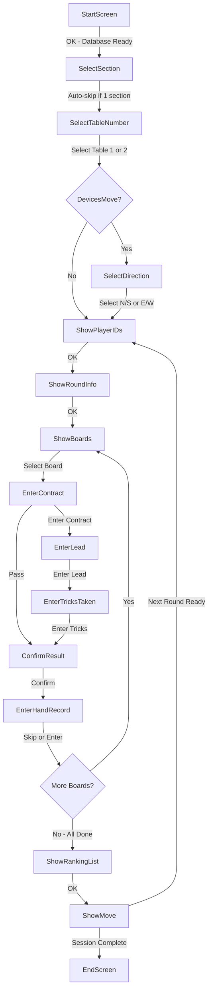

# Basic Bridge Game Test Plan

**Scenario:** 2 Tables, 8 Players (Pairs Movement)
**Purpose:** Validate the core user interaction flow for a simple bridge session

---

## Test Setup Tasks (Implementation Required)

The following tasks need to be implemented to enable automated or manual testing:

### 1. Create Test BWS Database File
**Status:** NOT IMPLEMENTED
**Priority:** HIGH

A Microsoft Access `.bws` database file must be created with the required schema and test data.

**Required Tables:**
| Table Name | Purpose |
|------------|---------|
| `Section` | Defines sections (A, B, etc.) with ID, Letter, Tables, Winners, MissingPair |
| `RoundData` | Movement data: Section, Table, Round, NSPair, EWPair, LowBoard, HighBoard |
| `Tables` | Table registration status (LogOnOff field) |
| `ReceivedData` | Stores entered results |
| `PlayerNumbers` | Player ID/name mappings |
| `PlayerNames` | Master player name lookup |
| `HandRecord` | Optional hand records for boards |
| `Settings` | Application settings per session |
| `Results` | Ranking/scoring results (populated by scoring program) |

**Test Data for 2-Table, 4-Pair Mitchell:**
```sql
-- Section table
INSERT INTO Section (ID, Letter, Tables, Winners, MissingPair)
VALUES (1, 'A', 2, 2, 0);

-- RoundData for Round 1
INSERT INTO RoundData (Section, Table, Round, NSPair, EWPair, LowBoard, HighBoard)
VALUES (1, 1, 1, 1, 2, 1, 2);
INSERT INTO RoundData (Section, Table, Round, NSPair, EWPair, LowBoard, HighBoard)
VALUES (1, 2, 1, 3, 4, 3, 4);

-- RoundData for Round 2 (pairs move)
INSERT INTO RoundData (Section, Table, Round, NSPair, EWPair, LowBoard, HighBoard)
VALUES (1, 1, 1, 1, 4, 3, 4);
INSERT INTO RoundData (Section, Table, Round, NSPair, EWPair, LowBoard, HighBoard)
VALUES (1, 2, 1, 3, 2, 1, 2);

-- Tables registration
INSERT INTO Tables (Section, Table, LogOnOff) VALUES (1, 1, 0);
INSERT INTO Tables (Section, Table, LogOnOff) VALUES (1, 2, 0);

-- Settings (defaults)
INSERT INTO Settings (ShowResults, ShowPercentage, LeadCard, BM2ValidateLeadCard,
  BM2Ranking, EnterResultsMethod, BM2ViewHandRecord, BM2NumberEntryEachRound,
  BM2NameSource, BM2EnterHandRecord)
VALUES (YES, YES, YES, YES, 1, 1, YES, NO, 0, NO);
```

### 2. Database File Location Strategy
**Options:**
- **Option A:** Create `.bws` file in `TabScore2/TestData/` directory
- **Option B:** Use existing scoring program (BridgeMate, etc.) to generate file
- **Option C:** Create programmatic database generator utility

**Recommendation:** Option A - Create a minimal test database file that can be version-controlled.

### 3. Automated Test Harness (Future)
**Status:** NOT IMPLEMENTED
**Priority:** MEDIUM

For automated testing, consider:
- Selenium/Playwright for browser automation
- Direct HTTP client tests against controllers
- Integration tests using `WebApplicationFactory<Program>`

---

## Prerequisites (Manual Testing)

1. **TabScore2 Application Running**
   - Launch TabScore2.exe (starts gRPC server and web server automatically)
   - Main desktop form should be visible

2. **Database Setup**
   - A BWS database file must be configured with:
     - 2 tables (Table 1 and Table 2)
     - 4 pairs (Pair 1-4)
     - At least 1 round with board assignments
     - Movement configured (e.g., Mitchell or Howell)

3. **Test Devices**
   - 2 web browsers or devices to simulate tablets at each table
   - Access URL: `http://<host-ip>:5213`

---

## User Flow Diagram



---

## Test Steps

### Phase 1: Application Startup and Database Selection

| Step | Action | Expected Result |
|------|--------|-----------------|
| 1.1 | Launch TabScore2.exe | Splash screen appears briefly, then MainForm displays |
| 1.2 | In MainForm, select a BWS database file | Database loads, status shows DatabaseReady = True |
| 1.3 | Configure settings if needed | Settings saved |

### Phase 2: Table 1 Registration

| Step | Action | Expected Result |
|------|--------|-----------------|
| 2.1 | Open browser to `http://localhost:5213` | StartScreen displays with version info |
| 2.2 | Click OK | Redirects to SelectSection or SelectTableNumber |
| 2.3 | Select Table 1 | SelectTableNumber shows table grid |
| 2.4 | Click OK | If DevicesMove=false, goes to ShowPlayerIDs |
| 2.5 | Verify player names display | Shows Pair 1 NS, Pair 2 EW for Table 1 |
| 2.6 | Click OK | ShowRoundInfo displays round details |
| 2.7 | Click OK | ShowBoards displays available boards |

### Phase 3: Table 2 Registration

| Step | Action | Expected Result |
|------|--------|-----------------|
| 3.1 | Open second browser to `http://localhost:5213` | StartScreen displays |
| 3.2 | Click OK | Redirects to SelectTableNumber |
| 3.3 | Select Table 2 | Table 2 selected |
| 3.4 | Click OK | Goes to ShowPlayerIDs |
| 3.5 | Verify player names | Shows Pair 3 NS, Pair 4 EW for Table 2 |
| 3.6 | Click OK | ShowRoundInfo displays |
| 3.7 | Click OK | ShowBoards displays |

### Phase 4: Enter Result for Board 1 at Table 1

| Step | Action | Expected Result |
|------|--------|-----------------|
| 4.1 | On Table 1 browser, click Board 1 | EnterContract screen displays |
| 4.2 | Enter contract: 4H by South | Contract level=4, suit=H, declarer=S selected |
| 4.3 | Click OK | EnterLead screen displays |
| 4.4 | Enter lead card: Club King | Lead card CK entered |
| 4.5 | Click OK | EnterTricksTaken screen displays |
| 4.6 | Enter tricks: 10 | Tricks taken = 10 entered |
| 4.7 | Click OK | ConfirmResult screen shows 4H S making 10 tricks |
| 4.8 | Click OK | Result saved, EnterHandRecord or ShowBoards displays |
| 4.9 | Skip hand record entry | Returns to ShowBoards |
| 4.10 | Verify Board 1 shows result | Board 1 marked as played |

### Phase 5: Enter Result for Board 1 at Table 2

| Step | Action | Expected Result |
|------|--------|-----------------|
| 5.1 | On Table 2 browser, click Board 1 | EnterContract screen displays |
| 5.2 | Enter contract: 3H by South | Contract entered |
| 5.3 | Enter lead: Spade Ace | Lead entered |
| 5.4 | Enter tricks: 9 | Tricks entered |
| 5.5 | Confirm result | Result saved |
| 5.6 | Return to ShowBoards | Board 1 marked as played |

### Phase 6: Complete Round and View Rankings

| Step | Action | Expected Result |
|------|--------|-----------------|
| 6.1 | Enter remaining boards at both tables | All boards for round completed |
| 6.2 | Click OK on ShowBoards when all done | ShowRankingList displays |
| 6.3 | Verify rankings | Pairs ranked by matchpoints or percentage |
| 6.4 | Click OK | ShowMove displays next round movement |

### Phase 7: Move to Next Round

| Step | Action | Expected Result |
|------|--------|-----------------|
| 7.1 | On Table 1, click OK on ShowMove | If next table ready, advances to ShowPlayerIDs |
| 7.2 | Verify new opponents | Different pair numbers displayed |
| 7.3 | Repeat for Table 2 | Both tables ready for Round 2 |

### Phase 8: Session Completion

| Step | Action | Expected Result |
|------|--------|-----------------|
| 8.1 | Complete all rounds | After final round, ShowMove redirects |
| 8.2 | View final rankings | ShowRankingList Final or EndScreen displays |
| 8.3 | Verify session complete | EndScreen shows session finished message |

---

## Key Validation Points

1. **Session State Persistence**
   - Device number stored in session cookie
   - Table/direction remembered across page navigations

2. **Concurrent Access**
   - Both tables can enter results simultaneously
   - No data conflicts between tablets

3. **Result Calculation**
   - Matchpoints calculated correctly when both tables play same board
   - Rankings update after each board

4. **Movement Logic**
   - Pairs move to correct tables each round
   - Boards rotate correctly

5. **Error Handling**
   - Invalid contracts rejected
   - Lead card validation works if enabled
   - Session timeout handled gracefully

---

## Configuration Variations to Test

| Setting | Values to Test | Impact |
|---------|----------------|--------|
| `DevicesMove` | True/False | Changes whether SelectDirection appears |
| `ShowTimer` | True/False | Timer display on scoring screens |
| `DefaultEnterLeadCard` | True/False | Skip lead entry if False |
| `DefaultShowTraveller` | True/False | Show/hide traveller after result |
| `DefaultShowRanking` | 0/1/2 | Never/After each round/Final only |

---

## Notes

- This test plan assumes a **Pairs** game (not Individual)
- For Individual games, set `IsIndividual = True` and expect 4 devices per table
- The gRPC server must be running for database operations to work
- All times are approximate; actual flow depends on user input speed
