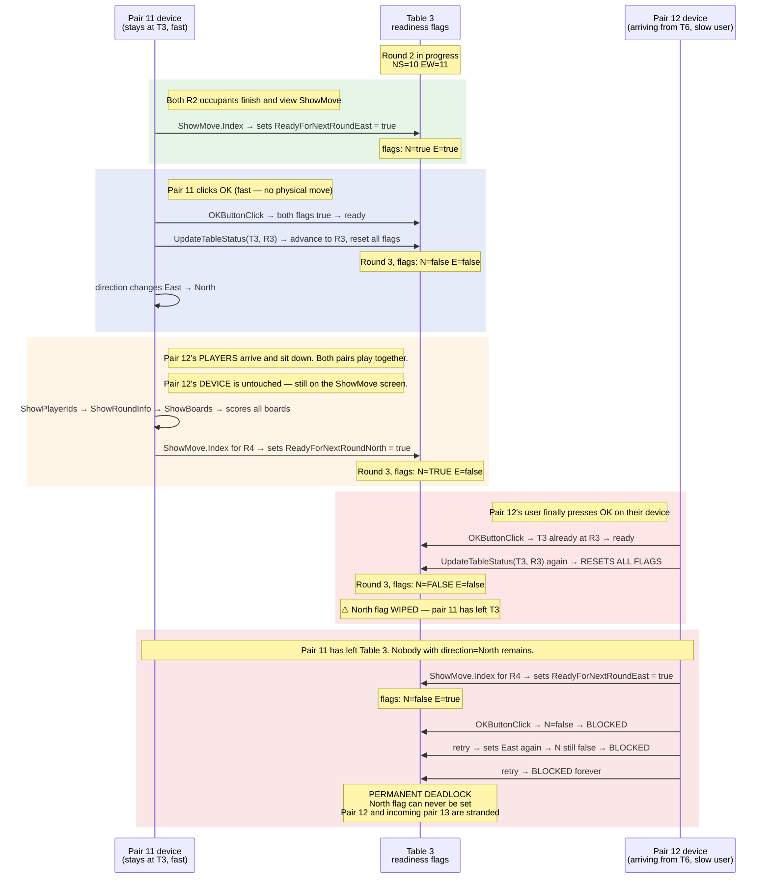

# Howell deadlock simulation

## What this test proves

In a Howell bridge movement each pair carries their own scoring device (a tablet or phone). The device travels with the pair from table to table throughout the event. At every table there are exactly two devices — one for the North/South pair and one for the East/West pair.

When a device finishes playing a round it sets a readiness flag on its current table — "I'm done here." A pair cannot sit down at a new table until both devices already there have set their flags, meaning the current occupants have finished playing and are ready to vacate.

For this test we use a 7-table Howell where one table is a **switch table** (Table 3). Every round the East/West pair stays and becomes North/South. Because there is no physical table change their device is the **fastest to move** — the player just switches seat and direction.

The pair arriving from another table must physically walk across the room. Their device is the **slowest to move**.

This timing gap creates a permanent deadlock in the original `UpdateTableStatus` code. The test reproduces it deterministically and confirms the one-line fix resolves it.

## The defect

`UpdateTableStatus` is called by **every** device that successfully moves to a table. It unconditionally resets all four readiness flags, even when the table has already been advanced to that round by a prior caller.

```csharp
// Original — always resets
public void UpdateTableStatus(int sectionId, int tableNumber, int roundNumber)
{
    TableStatus tableStatus = GetTableStatus(sectionId, tableNumber)!;
    tableStatus.RoundNumber = roundNumber;
    tableStatus.RoundData = database.GetRound(sectionId, tableNumber, roundNumber);
    tableStatus.ReadyForNextRoundNorth = false;  // ← unconditional reset
    tableStatus.ReadyForNextRoundSouth = false;
    tableStatus.ReadyForNextRoundEast  = false;
    tableStatus.ReadyForNextRoundWest  = false;
}
```

## The fix

Skip the reset if the table is already at the requested round:

```csharp
public void UpdateTableStatus(int sectionId, int tableNumber, int roundNumber)
{
    TableStatus tableStatus = GetTableStatus(sectionId, tableNumber)!;
    if (tableStatus.RoundNumber >= roundNumber) return;  // ← guard
    tableStatus.RoundNumber = roundNumber;
    tableStatus.RoundData = database.GetRound(sectionId, tableNumber, roundNumber);
    tableStatus.ReadyForNextRoundNorth = false;
    tableStatus.ReadyForNextRoundSouth = false;
    tableStatus.ReadyForNextRoundEast  = false;
    tableStatus.ReadyForNextRoundWest  = false;
}
```

## How the deadlock forms

The sequence below shows the Round 2 → Round 3 transition at Table 3 in a 7-table Howell. Pair 11 stays (switches East → North). Pair 12 arrives from Table 6.



## What the two tests assert

| Test | Asserts | Purpose |
|------|---------|---------|
| `Original_Code_Deadlocks` | Pair 12 is **permanently blocked** | Confirms the defect exists in the original logic |
| `Fixed_Code_No_Deadlock` | Pair 12 **moves successfully** | Confirms the one-line guard resolves the deadlock |

Both tests run the identical event sequence. The only difference is whether `UpdateTableStatus` includes the `if (RoundNumber >= roundNumber) return` guard.

## Conditions required to trigger

All of these must be true simultaneously:

1. **Howell movement** with a switch table (EW stays and becomes NS)
2. **2 devices per table** (the readiness gate checks both North and East flags)
3. **The staying pair completes an entire round** before the arriving pair's `UpdateTableStatus` call executes
4. **The staying pair then leaves** the table, so no device with direction=North remains to re-set the flag

## Why this doesn't happen every time

The deadlock requires a specific timing gap. The arriving pair's `UpdateTableStatus` call only causes damage if the staying pair has already finished the round **and** set a readiness flag for the next transition. If the arriving pair sits down promptly the sequence is harmless:

```
Staying pair advances table → flags reset
Arriving pair calls UpdateTableStatus again → flags reset again (harmless, nothing was set yet)
Both pairs play the round together
Both pairs set flags for the next transition → no conflict
```

The dangerous sequence requires the arriving pair's **device** to lag behind their **physical presence** at the table. Both pairs must be seated and play the boards together before any scores can be entered — but the arriving user never presses OK on their device's move screen. Their tablet is still showing "Move to Table 3" from the previous transition while the round is played and scored:

```
Staying pair's device advances table → flags reset
Arriving pair's PLAYERS walk to the table and sit down
Both pairs play the boards together (bridge requires both pairs)
Staying pair's device scores all boards (arriving pair's device is irrelevant to scoring)
Staying pair's device views ShowMove for the NEXT round → sets North flag
Tournament director calls "move!" — arriving pair's user finally presses OK on their device
Arriving pair's DEVICE completes the old transition → UpdateTableStatus → North flag destroyed
```

At most tournaments players operate their devices promptly and the second `UpdateTableStatus` call fires before anyone has set flags for the next transition — so there is nothing to wipe. The window only opens when a user neglects their device long enough for an entire round of physical play and scoring to complete before they press OK.